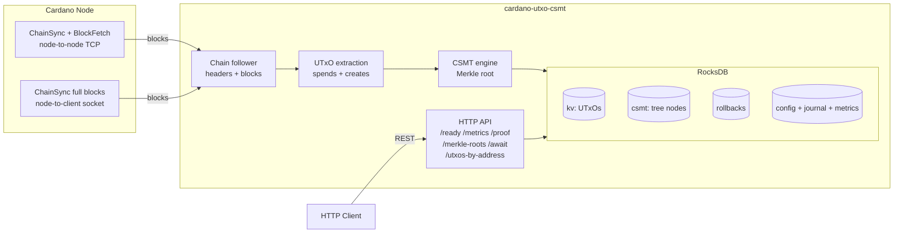

# Cardano UTxO CSMT

[](https://github.com/lambdasistemi/cardano-utxo-csmt/actions/workflows/CI.yaml)
[](https://github.com/lambdasistemi/cardano-utxo-csmt/actions/workflows/deploy-docs.yaml)

An HTTP service that maintains a Compact Sparse Merkle Tree (CSMT) over
Cardano's UTxO set, enabling efficient cryptographic inclusion proofs.

## What is this

`cardano-utxo-csmt` follows the Cardano chain, tracks the live UTxO set,
and keeps a Compact Sparse Merkle Tree over it in a local RocksDB
database. Every block updates the tree and produces a new Merkle root
that commits to the entire UTxO set at that point.

It connects to a Cardano node in one of two modes: node-to-node over TCP
(ChainSync headers plus BlockFetch) or node-to-client over a Unix socket
(ChainSync streaming full blocks). UTxO references are stored CBOR-encoded
so the same representation works across all eras (Byron through Conway),
and TxOuts are projected to the Conway era before storage. Chain
reorganizations are handled by replaying stored inverse operations from
rollback points.

A REST API exposes the current sync metrics, historical Merkle roots, and
on-demand inclusion proofs for individual UTxOs. The service bootstraps a
fresh database from genesis (Shelley, plus optional Byron `nonAvvmBalances`)
and then syncs every block from Origin.

The repository is a single Haskell package (`cardano-utxo-csmt`) with
several internal libraries and three executables: the `cardano-utxo`
service, a `db-query` debug tool, and a `cardano-utxo-swagger` OpenAPI
emitter.

## Architecture



In node-to-node mode the ChainSync client receives headers and the
BlockFetch client retrieves full blocks; in node-to-client mode a single
ChainSync client streams full blocks over the socket. Either way, each
block's spends and creates are applied to the `kv` (UTxO) and `csmt`
(tree) column families, rollback points are recorded, and a new Merkle
root is computed. See [docs/architecture.md](docs/architecture.md) for
the full data flow and the database schema in
[docs/database-schema.md](docs/database-schema.md).

## Install

The service is distributed as a Nix flake. Pre-built artifacts (Docker
image, AppImage, RPM, DEB, and platform tarballs) are produced by CI and
attached to GitHub releases.

```bash
# Run directly from the flake (recommended)
nix run github:lambdasistemi/cardano-utxo-csmt -- --help

# Optional: enable the binary cache to avoid rebuilding dependencies
nix shell nixpkgs#cachix -c cachix use paolino
```

Docker images are published to
`ghcr.io/lambdasistemi/cardano-utxo-csmt/cardano-utxo`. The flake builds
for `x86_64-linux` and `aarch64-darwin`.

## Quickstart

Run against a node on preprod, bootstrapping from genesis. This example
uses node-to-client (`--socket-path`); use `--node-name`/`--node-port`
instead for node-to-node.

```bash
nix run github:lambdasistemi/cardano-utxo-csmt -- \
  --network preprod \
  --socket-path /path/to/node.socket \
  --genesis-file /path/to/shelley-genesis.json \
  --byron-genesis-file /path/to/byron-genesis.json \
  --db-path /tmp/csmt-db \
  --api-port 8080

# Once running, check readiness and query a proof:
curl http://localhost:8080/ready
curl http://localhost:8080/proof/<txId>/<txIx>
```

`--genesis-file` (Shelley) is always required: it provides the security
parameter `k`, network magic, and epoch slots, and seeds the initial
UTxO set on a fresh database. `--byron-genesis-file` is optional but
recommended when syncing from Origin so that blocks spending Byron
genesis UTxOs do not fail. See
[docs/getting-started.md](docs/getting-started.md) for the full option
list.

## Usage

### Service (`cardano-utxo`)

Key command-line options (run `cardano-utxo --help` for the complete
list; all `conf` options may also be set via a YAML `--config-file`):

| Option | Description |
|--------|-------------|
| `--network`, `-n` | `mainnet`, `preprod`, `preview`, or `devnet` (default: `mainnet`) — selects default peer node |
| `--socket-path` | Node Unix socket path (node-to-client mode) |
| `--node-name`, `-s` / `--node-port`, `-p` | Peer node host and port (node-to-node mode) |
| `--db-path`, `-d` | RocksDB database directory (required) |
| `--genesis-file` | Path to `shelley-genesis.json` (required) |
| `--byron-genesis-file` | Path to `byron-genesis.json` (optional, for genesis bootstrap) |
| `--api-port` | Port for the REST API server |
| `--api-docs-port` | Port for the Swagger UI documentation server |
| `--log-path`, `-l` | Log file path (logs to stdout if omitted) |
| `--config-file`, `-c` | YAML configuration file |
| `--headers-queue-size`, `-q` | Header queue size (default: 10) |
| `--sync-threshold` | Max slots behind tip to be considered synced (default: 100) |
| `--enable-metrics-reporting` | Emit metrics on stdout |

### REST API

| Endpoint | Description |
|----------|-------------|
| `GET /ready` | Sync readiness (`ready`, `tipSlot`, `processedSlot`, `slotsBehind`) |
| `GET /metrics` | Current sync metrics (JSON) |
| `GET /metrics/prometheus` | Metrics in Prometheus exposition format |
| `GET /merkle-roots` | Historical Merkle roots by block |
| `GET /proof/:txId/:txIx` | Inclusion proof for a UTxO |
| `GET /utxos-by-address/:address` | UTxOs at an address |
| `GET /await/:txId/:txIx?timeout=N` | Block until a UTxO appears (HTTP 408 on timeout) |
| `GET /api-docs/swagger-ui` | Swagger UI (when `--api-docs-port` is set) |

Endpoints other than `/ready`, `/metrics`, and `/metrics/prometheus`
return HTTP 503 until the service reports synced.

### Debug tool (`db-query`)

```bash
db-query --db-path /tmp/csmt-db --txid <64-hex-txid> [--index N]
```

Looks up a TxIn in the `kv` column family; with `--index` omitted it
probes indices 0–3.

### Local run helper

`run/cardano-utxo.sh <preview|preprod|mainnet>` wraps the service against
local Docker-hosted nodes using the matching `config/<network>.yaml`. See
[run/README.md](run/README.md).

## Documentation

Full documentation: **[lambdasistemi.github.io/cardano-utxo-csmt](https://lambdasistemi.github.io/cardano-utxo-csmt/)**

- [Getting Started](https://lambdasistemi.github.io/cardano-utxo-csmt/getting-started/)
- [Architecture](https://lambdasistemi.github.io/cardano-utxo-csmt/architecture/)
- [Database Schema](https://lambdasistemi.github.io/cardano-utxo-csmt/database-schema/)
- [API Reference](https://lambdasistemi.github.io/cardano-utxo-csmt/swagger-ui/)

For AI agents, start at [AGENTS.md](AGENTS.md).

## Development

The project uses Nix and a `justfile`. Enter the dev shell with
`nix develop`, then:

```bash
just build        # cabal build all --enable-tests --enable-benchmarks
just unit         # unit-tests suite
just database     # database-tests suite (RocksDB-backed)
just format       # fourmolu + cabal-fmt + nixfmt
just hlint        # hlint
just CI           # full local CI gate
just serve-docs   # mkdocs serve on a free port
just update-swagger  # regenerate docs/assets/swagger.json
```

Integration and end-to-end suites (`just integration`, `just e2e`,
`just e2e-n2n`, `just e2e-genesis`) require a `cardano-node` and Docker.
The Nix flake exposes the corresponding outputs (`.#cardano-utxo`,
`.#unit-tests`, `.#database-tests`, `.#bench`, `.#e2e-tests`,
`.#docker-image`).

## License

Apache-2.0. See [LICENSE](LICENSE).
