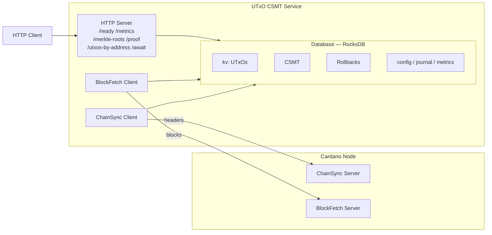
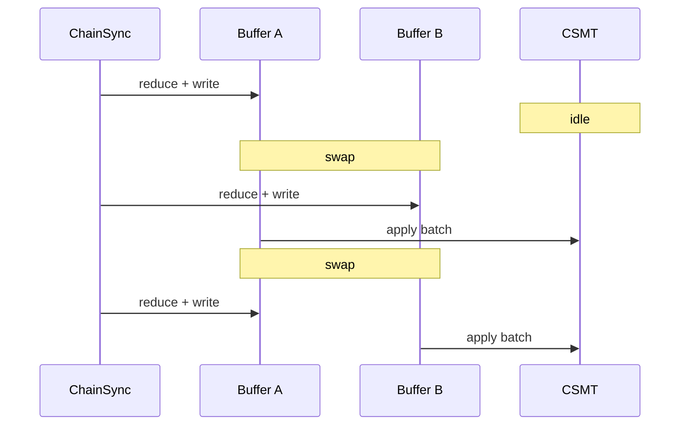

# Architecture

This document describes the high-level architecture of the Cardano UTxO CSMT service.

## Overview

The diagram shows **node-to-node** mode, where a ChainSync client follows
headers and a BlockFetch client retrieves full blocks. In
**node-to-client** mode (`--socket-path`) a single ChainSync client
streams full blocks over a Unix socket and no separate BlockFetch client
is used; everything downstream of block arrival is identical.

## Components

### Chain Synchronization

The service connects to a Cardano node in one of two modes, selected by
the command-line options:

- **Node-to-node** (`--node-name` + `--node-port`): a ChainSync client
  follows the chain tip receiving block headers, a BlockFetch client
  retrieves full block data, and KeepAlive maintains the connection.
  Headers are queued (`--headers-queue-size`) and blocks are fetched in
  batches for efficiency.
- **Node-to-client** (`--socket-path`): a single ChainSync client streams
  full blocks over the node's local Unix socket; there is no separate
  BlockFetch client.

Both modes feed the same UTxO processing pipeline.

### UTxO Processing

For each block, the service extracts UTxO changes:

- **Spends**: Inputs consumed by transactions (deletions)
- **Creates**: Outputs produced by transactions (insertions)

UTxO references are CBOR-encoded for consistent storage across all eras (Byron through Conway).

### Compact Sparse Merkle Tree (CSMT)

The CSMT provides efficient membership proofs:

- **Insertion**: O(log n) with path compression
- **Deletion**: O(log n) with automatic compaction
- **Proof Generation**: O(log n) inclusion proofs

The Merkle root changes with each block, providing a cryptographic commitment to the UTxO set state.

### Database (RocksDB)

Six column families store different data:

| Column | Key | Value |
|--------|-----|-------|
| `kv` | TxIn (CBOR) | TxOut (CBOR) |
| `csmt` | Path | Hash + Jump |
| `rollbacks` | Slot (or sentinel) | Inverse operations for rollback |
| `config` | `"app_config"` | Serialised checkpoint/config |
| `journal` | TxIn | Pending entry for KVOnly-mode replay |
| `metrics` | counter name | Journal size counter |

Rollback points enable chain reorganization handling without full
recomputation. The `journal` and `metrics` columns support crash
recovery during bulk replay; see
[Database Schema](database-schema.md) for the full CDDL of the
user-facing columns.

### HTTP API

The REST API provides:

- `GET /ready` - Sync readiness for orchestration
- `GET /metrics` - Sync progress and performance metrics (JSON)
- `GET /metrics/prometheus` - Metrics in Prometheus exposition format
- `GET /merkle-roots` - Historical merkle roots by block
- `GET /proof/:txId/:txIx` - Inclusion proof for a UTxO
- `GET /utxos-by-address/:address` - UTxOs at an address
- `GET /await/:txId/:txIx?timeout=N` - Block until a UTxO appears

All endpoints except `/ready`, `/metrics`, and `/metrics/prometheus`
return HTTP 503 until the service reports synced.

## Data Flow

1. **Block Arrival**: ChainSync receives header, BlockFetch retrieves block
2. **UTxO Extraction**: Parse transactions, extract inputs/outputs
3. **Database Update**: Apply changes atomically (deletes + inserts)
4. **CSMT Update**: Update Merkle tree, compute new root
5. **Finality Tracking**: Move finality point, prune old rollback data

## Rollback Handling

When the node reports a rollback:

1. Find the rollback point in stored history
2. Apply inverse operations to restore previous state
3. Resume following from the new chain tip

If rollback exceeds stored history (truncation), the service restarts sync from genesis.

## Bootstrapping

### Genesis Bootstrap

On a fresh database the service bootstraps by reading the initial UTxO
set from the Shelley genesis file (always required) and, when provided,
the Byron genesis file's `nonAvvmBalances`, then syncing all blocks from
Origin. Key optimizations:

1. **Era projection**: Project all TxOut to Conway era before storage
2. **Change reduction**: Reduce UTxO changes inline as ChainSync writes to the buffer,
   eliminating transient UTxOs that are created and consumed during sync
3. **Double buffering**: ChainSync and CSMT work concurrently on separate buffers

Reduction happens inline during ChainSync writes:

- **Insert**: add `TxIn → TxOut` to active buffer
- **Delete**: if `TxIn` exists in buffer, remove it (transient UTxO eliminated);
  otherwise record as pending delete

CSMT applies the already-reduced batch without additional processing.

For fast bootstrap via Mithril snapshots, see
[cardano-mithril-client](https://github.com/lambdasistemi/cardano-mithril-client).
