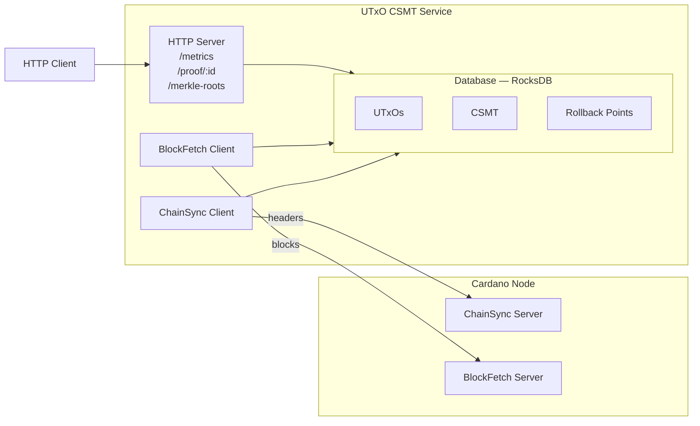
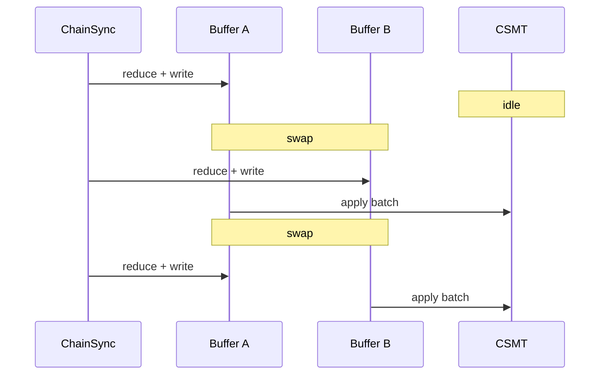

# Architecture

This document describes the high-level architecture of the Cardano UTxO CSMT service.

## Overview

## Components

### Chain Synchronization

The service connects to a Cardano node using the node-to-node protocol:

- **ChainSync Client**: Follows the chain tip, receiving block headers
- **BlockFetch Client**: Retrieves full block data for processing
- **KeepAlive**: Maintains the connection

Headers are queued and blocks are fetched in batches for efficiency.

### UTxO Processing

For each block, the service extracts UTxO changes:

- **Spends**: Inputs consumed by transactions (deletions)
- **Creates**: Outputs produced by transactions (insertions)

UTxO references are CBOR-encoded for consistent storage across all eras (Byron through Conway).

### Compact Sparse Merkle Tree (CSMT)

The CSMT provides efficient membership proofs:

- **Insertion**: O(log n) with path compression
- **Deletion**: O(log n) with automatic compaction
- **Proof Generation**: O(log n) inclusion proofs

The Merkle root changes with each block, providing a cryptographic commitment to the UTxO set state.

### Database (RocksDB)

Three column families store different data:

| Column | Key | Value |
|--------|-----|-------|
| UTxOs | TxIn (CBOR) | TxOut (CBOR) |
| CSMT | Path | Hash + Jump |
| Rollback Points | Slot | Changes for rollback |

Rollback points enable chain reorganization handling without full recomputation.

### HTTP API

The REST API provides:

- `GET /metrics` - Sync progress and performance metrics
- `GET /merkle-roots` - Historical merkle roots by slot
- `GET /proof/:txId/:txIx` - Inclusion proof for a UTxO

## Data Flow

1. **Block Arrival**: ChainSync receives header, BlockFetch retrieves block
2. **UTxO Extraction**: Parse transactions, extract inputs/outputs
3. **Database Update**: Apply changes atomically (deletes + inserts)
4. **CSMT Update**: Update Merkle tree, compute new root
5. **Finality Tracking**: Move finality point, prune old rollback data

## Rollback Handling

When the node reports a rollback:

1. Find the rollback point in stored history
2. Apply inverse operations to restore previous state
3. Resume following from the new chain tip

If rollback exceeds stored history (truncation), the service restarts sync from genesis.

## Bootstrapping

### Genesis Bootstrap

The service bootstraps by reading the initial UTxO set from Byron and Shelley
genesis files, then syncing all blocks from Origin. Key optimizations:

1. **Era projection**: Project all TxOut to Conway era before storage
2. **Change reduction**: Reduce UTxO changes inline as ChainSync writes to the buffer,
   eliminating transient UTxOs that are created and consumed during sync
3. **Double buffering**: ChainSync and CSMT work concurrently on separate buffers

Reduction happens inline during ChainSync writes:

- **Insert**: add `TxIn → TxOut` to active buffer
- **Delete**: if `TxIn` exists in buffer, remove it (transient UTxO eliminated);
  otherwise record as pending delete

CSMT applies the already-reduced batch without additional processing.

For fast bootstrap via Mithril snapshots, see
[cardano-mithril-client](https://github.com/lambdasistemi/cardano-mithril-client).
