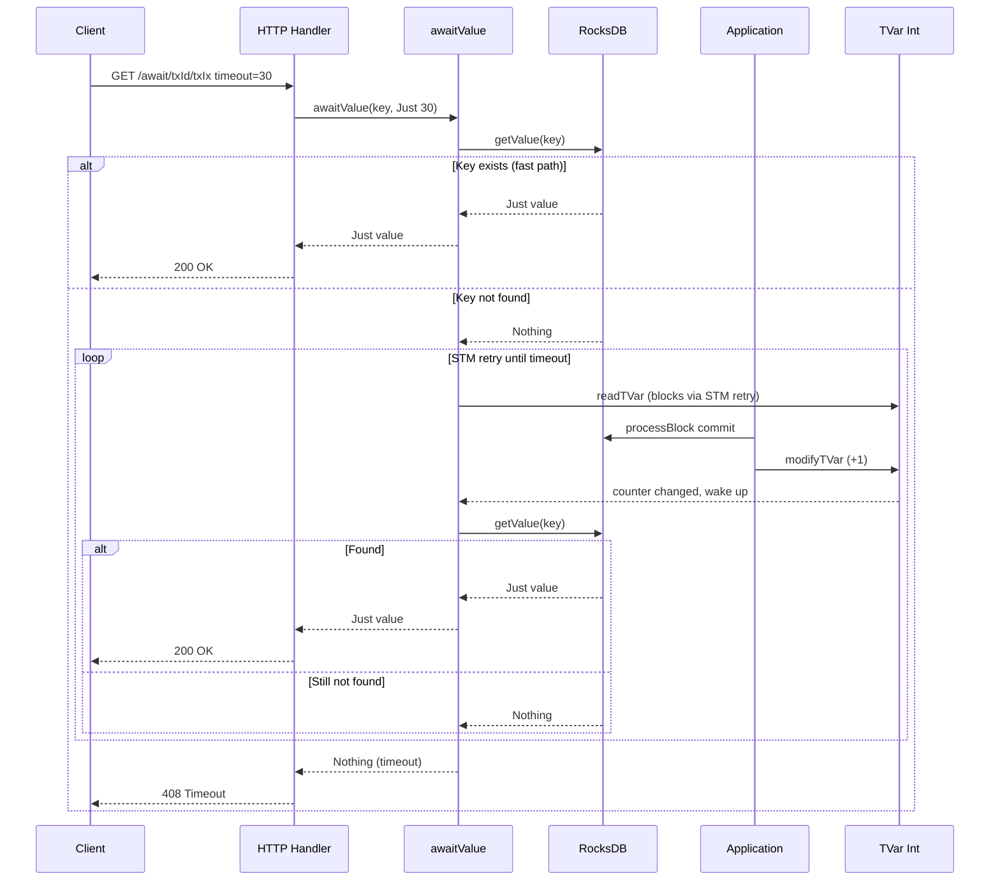

# Data Model: Push-based UTxO Await

## New Entities

### CommitNotification

A `TVar Int` counter incremented after each successful `processBlock` commit.

- Created at application startup (Main.hs)
- Written by: Application chain sync loop (after each commit)
- Read by: Query.awaitValue (STM retry on counter change)

### awaitValue (Query field)

```
awaitValue :: key -> Maybe Int -> m (Maybe value)
```

- `key`: the UTxO key to wait for
- `Maybe Int`: optional timeout in seconds (Nothing = server default)
- Returns `Just value` if found, `Nothing` on timeout

### HTTP Endpoint

```
GET /await/:txId/:txIx?timeout=30
```

- Path parameters: transaction ID and index (same format as /proof/:txId/:txIx)
- Query parameter: timeout in seconds (default: 30, max: 120)
- Response 200: value found (same format as existing UTxO responses)
- Response 408: timeout expired

## State Flow


