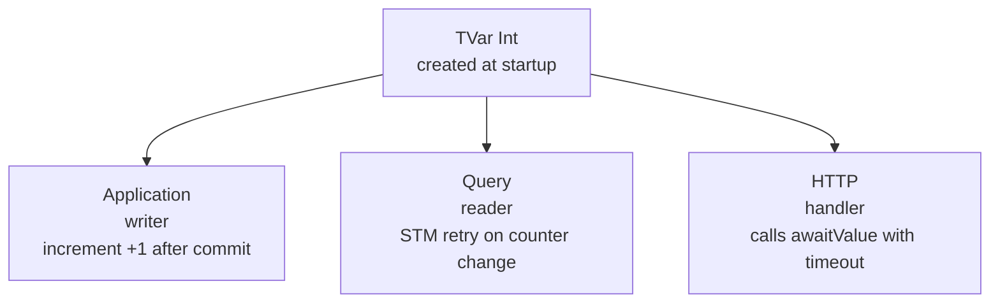

# Implementation Plan: Push-based UTxO Await

**Branch**: `002-await-value` | **Date**: 2026-03-27 | **Spec**: [spec.md](spec.md)

## Summary

Add a TVar-based notification mechanism so clients can block-wait for a key to appear in the UTxO set instead of polling. A single `TVar Int` counter is incremented after each commit; `awaitValue` uses STM retry to block until the counter changes, then re-checks the key.

## Technical Context

**Language/Version**: Haskell (GHC 9.8.4)
**Primary Dependencies**: `stm` (TVar, STM), `servant-server` (HTTP API), `rocksdb-kv-transactions`
**Storage**: RocksDB — `getValue` already exists, `awaitValue` wraps it with STM blocking
**Testing**: HSpec (unit-tests for STM logic, database-tests for integration)
**Target Platform**: Linux (NixOS)
**Project Type**: Library + HTTP service
**Constraints**: Must not break existing Query consumers; coarse-grained notification (no per-key TVars)

## Constitution Check

| Principle | Status | Notes |
|-----------|--------|-------|
| Pure core / impure shell | Pass | TVar is IO-layer; Query interface gains an IO operation |
| Correctness | Pass | STM retry guarantees no missed notifications |
| Small focused commits | Pass | Can split: notification mechanism, Query extension, HTTP endpoint |
| Test separation | Pass | Unit test for STM logic, database-test for integration |
| Nix-first | Pass | `stm` is already a dependency |

No violations.

## Project Structure

### Affected Files

```text
lib/Cardano/UTxOCSMT/Application/Database/Interface.hs
    — Add awaitValue to Query type

application/Cardano/UTxOCSMT/Application/Run/Application.hs
    — Increment TVar after each processBlock commit

application/Cardano/UTxOCSMT/Application/Run/Main.hs
    — Create TVar at startup, thread to Application and HTTP server

application/Cardano/UTxOCSMT/Application/Run/Query.hs
    — Implement awaitValue handler wrapping getValue + STM retry

http/Cardano/UTxOCSMT/HTTP/API.hs
    — Add GET /await/:txId/:txIx endpoint to Servant API

http/Cardano/UTxOCSMT/HTTP/Server.hs
    — Add handler for await endpoint

test/ or database-test/
    — Tests for await mechanism
```

### Architecture


